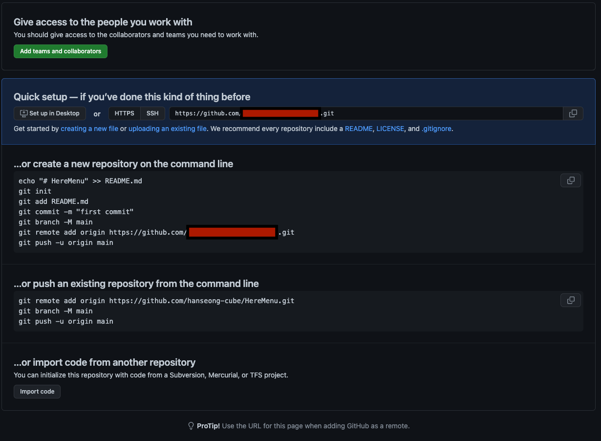

# 나도 깃헙 다같이 사용해보고 싶다고요..!

나는 과거에 팀원들과 작업을 해볼 일이 없었다. 그렇기에 깃헙을 같이 사용해볼 일도 없었다.  
정말 다같이 사용해보고 싶다라는 생각이 많이 들었다. 그리고 드디어 기회가 왔다. 멋쟁이사자처럼 프론트엔드 2기에서 속해있는 팀원들과 공동으로 깃헙을 처음 만들게 되었다.  
나도 깃과 깃헙을 잘 모르고 팀원들도 잘 모르는 눈치였다. 그래서 정보를 찾고 공유하기로 했다. 이 글이 또 다른 스터디그룹원들과 공유되어 원활하게 스터디그룹이 진행되었으면 하는 바램도 있다. 그럼 시작하자!  
다음은 git과 github 사용했던 것을 기록한다.

## Repositotry 생성

좋아. 드디어 공동으로 만들 레파지토리를 만들었다. 이것에 대한 방법은 따로 적지 않아도 될거같다.

## Collaborators 추가

레파지토리 만든사람이 이 레파지토리를 같이 관리할 수 있게 다음과 같은 작업을 해주면 된다.

1. github에서 만든 레파지토리 들어가기
2. Settings 클릭
3. Collaborators 클릭
4. Manage access에서 Add people 추가
   > 이 과정이 끝나면 github에 등록한 메일로 초대장이 날라가게된다. 초대받은사람들은 초대수락하면된다.

## clone

레파지토리 생성시 README 파일을 생성하면 git clone 하면된다. (git clone은 조금 있다가..!) 하지만 아무파일도 생성하지않고 레파지토리를 만들면 폴더를 만들어 다음과 같은 작업을 해줘야 한다. 아래 글과 사진을 참고하자.

### 과정

1. 우선 레파지토리 만든사람이 컴퓨터에 폴더를 만든다.
2. 먼저 git bash 나 터미널에서 폴더경로에 들어간다. ('cd "경로"' 를 통해) 그리고 아래 명령어를 입력한다.
   > (visual studio code 터미널도 동일!)
3. 아래 명령어 입력.

```
git init
```

```
git add README.md
```

```
git commit -m "Create README"
```

```
git branch -M main
```

```bash
git remote add origin [ 경로 ] # 대괄호 빼고
```

> 경로는 아래 사진을 보면 빨간색박스가 있는 라인이 있는데 그것을 입력하면 된다.  
> 또는 레파지토리에서 Code 누르면 HTTPS 주소 보이는데 그것을 입력하면 된다.

```
git push -u origin main
```

**사진 참고하기!**


### git clone

1. clone할 컴퓨터에 폴더를 만든다.
2. 먼저 git bash 나 터미널에서 폴더경로에 들어간다. ('cd "경로"' 를 통해) 그리고 아래 명령어를 입력한다.
   > (visual studio code 터미널도 동일!)
3. 명령어 입력

```bash
git clone [ 경로 ] # 대괄호 빼고
```

> 레파지토리에서 Code 누르면 HTTPS 주소 보이는데 그것을 입력하면 된다.

## git config 설정

```bash
# config 확인
git config --global --list

# config 설정하기
git config --global "user.name(본인 닉네임)"
git config --global "user.email(자신의 이메일)"

# config 삭제하기
git config --unset --global "user.name(본인 닉네임)"
git config --unset --global "user.email(본인 이메일)"
```

> 본인 닉네임은 깃헙 우측 상단 눌렀을때 Signed in as 닉네임  
> 본인 이메일은 깃헙 우측 상단 눌러서 Settings > 좌측 Emails 에서 확인 가능

## pull에 대하여

나는 git pull을 시도해봤다. 하지만 제대로 작동하지않았다.  
다음 명령어를 쓰니 정상적으로 작동했다.

```bash
# pull 하기
git pull

# pull이 안될때 과정
git fetch --all
git reset --hard origin/main #default 브랜치가 다르다면 main말고 master를 쓸수도 있겠지?
```

## branch에 대하여

```bash
# 브랜치 확인
git branch

# 브랜치 만들기
git branch [branchname]  # 대괄호 없이 사용! 앞으로도 계속!

# 브랜치 이동  # 브랜치 이동에는 checkout, switch, restore 이 있는데 나중에 공부해서 업데이트하기..!
git checkout [branchname]

# 브랜치 삭제
git branch -d [branchname]

# 원격(레파지토리에 있는) 브랜치 삭제
git push origin --delete [branchname]

# 참고사항.
# default 브랜치에는 main 브랜치가 있고, master 브랜치가 있다.
# 과거에는 master 브랜치가 default였는데 지금은 main 브랜치로 바뀌었다.
# 깃헙 레파지토리에 가서 default브랜치가 어떤건지 확인하고 변경하자!

# default 브랜치 변경방법
git branch -M [default branch]
```

## add에 대하여

```bash
# 방법 1 : 이것은 작업한 모든것이 add된다. 별로 권하지 않는다.
git add .

# 방법 2
git add [경로/작업물] #예시 : git add ./kihoon/index.html  <- 여기서 kihoon은 폴더고 index.html 은 작업물이겠지?
```

## commit에 대하여

```bash
# commit 하기
git commit -m ["메시지작성"]   # 대괄호는 쓰지않지만 큰따옴표는 써야한다.

# commit 취소
# 커밋취소에는 여러가지 방법이 있지만 이것도 공부하고 실습해서 업데이트하자!
git log # 본인이 커밋했는지 로그 확인
git reset HEAD~1 # 가장 최근에 커밋한것을 지우자. (급한불부터...)

## commit 메시지 변경
git commit --amend # 리눅스를 다룰수 있으면 사용방법을 알텐데..(물론 나도 잘모름) 이것은 나중에 직접 보면서 이야기하기..
```

## push에 대하여

```bash
git push origin [브랜치이름] # 대괄호 없이

# git push 취소하기
git reset HEAD^ # 가장 최근의 커밋을 취소
```

## 기록

push가 정상적으로 끝나고 Repository에 들어가면 Compare & pull request가 생기고 그것을 누르면 PR을 만들 수 있다.  
PR를 날리면 팀원들과 코멘트를 달며 코드리뷰를 진행할 수 있다. 이 과정은 다음 [참고자료 2번](https://www.youtube.com/watch?v=9FZaYz0s8s4&ab_channel=%EB%9D%BC%EB%A7%A4%EA%B0%9C%EB%B0%9C%EC%9E%90)을 보면 좋을것같다.

이슈1. push를 2번했을 때 pull requests가 2개가 생기는게 아니라 PR에 덧붙여지는것을 확인했다.

### 참고자료

1. [add, commit, push 취소하기](https://gmlwjd9405.github.io/2018/05/25/git-add-cancle.html)
2. [Github으로 팀 프로젝트 하기 1편 | Pull request 코드리뷰 개발자](https://www.youtube.com/watch?v=9FZaYz0s8s4&ab_channel=%EB%9D%BC%EB%A7%A4%EA%B0%9C%EB%B0%9C%EC%9E%90)
3. [Github으로 팀 프로젝트 하기 2편 | conflict 해결 개발자](https://www.youtube.com/watch?v=FmLzvXyFKIE&ab_channel=%EB%9D%BC%EB%A7%A4%EA%B0%9C%EB%B0%9C%EC%9E%90)
