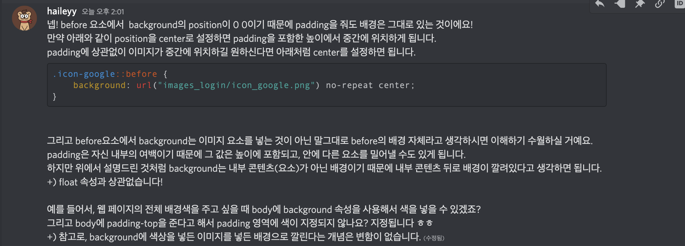

# float의 상하 위치조절 & 네거티브마진

재현님의 수업을 들으면서 내 머릿속에는 float을 사용하면 margin-top 또는 margin-bottom 으로 상하 조절을 할 수 있다는 기억이 있었다.  
그리고 그것을 테스트해보기로 했다.  
margin-top을 사용했을 때는 내가 생각한 그림처럼 상하 조절이 가능했다.  
하지만 margin-bottom을 사용했을 때 내가 생각하는 것과 다르게 움직이지 않았다.  
 내가 잘못 기억하고 있는것인가? 많은 생각이 들었다.

아래에 여러 테스트 결과가 있다.

```html
<!DOCTYPE html>
<html lang="en">
  <head>
    <style>
      .container {
        width: 300px;
        height: 30px;
        border: 1px solid black;
        text-align: center;
        padding: 10px 20px;
      }

      .container::before {
        content: "";
        background-image: url("https://static.xx.fbcdn.net/rsrc.php/yD/r/d4ZIVX-5C-b.ico");
        background-size: cover;
        width: 20px;
        height: 20px;
        float: left;
        margin-top: 10px;
        /* margin-bottom: 10px; */
      }
    </style>
  </head>
  <body>
    <div class="container">
      <span>배기훈</span>
    </div>
  </body>
</html>
```

1. **margin 을 사용하지 않았을 경우**  
   

2. **margin-top: 10px 사용**  
     
     
    좋아..! 내가 원하는대로 내려간다..!

3. **margin-top: -10px 사용**  
   
     
   좋아..! 맞아..! 내가 원하는대로 올라가고있어..! 근데 마이너스 마진이여서 그런지 아이콘을 선택했을 때 안보이네..? -10px 마진이 먹힌건 보이는데..

4. **margin-bottom: 35px 사용**  
   
     
   뭐여 이거 왜이래? 내 생각대로면 페이스북 아이콘이 위로 올라가야하는데..?

   1번에서 보이는 **margin을 사용하지 않았을 경우**의 위치와 동일한 위치에 있고, margin-bottom: 35px은 적용되긴했다.  
   페이스북 아이콘도 위치변경이 없었고, '배기훈' 이 들어있는 container의 위치는 늘어나지않았다.

   **margin-bottom을 주면 올라가야하는거 아니여? 왜 위로 안올라가?**

   우리가 어떤 요소에 margin top과 bottom을 줄 때, 해당 요소는 **자신의 기준점**을 기준으로 위 아래 여백을 만들게된다.  
   margin-top을 줄 때는 자신의 위로 여백이 생기면서 자신의 내부 콘텐츠는 여백만큼 아래로 밀게 된다.  
    근데 margin-bottom: 35px을 줬다고 아래 여백이 생겼다고 해당 페이스북 아이콘이 위로 올라간다고?? 아니지 아니지!!!!  
    내 기억은 조작되어있던것이였다. 그냥 해당 요소의 아래로 여백이 생기는것이다. 그래서 margin-bottom: 35px을 주었을 때 위로 올라가지 않는건 너무나 당연한 결과였다.

   **그럼 왜 부모 contain의 위치는 안늘어나???**

   그 이유는 float속성을 사용했기 때문에 부모가 해당 요소의 높이값을 감지하지 못하고, 해당 요소의 margin-bottom은 부모의 padding과 겹치게 된다.

   **ㅇㅇ ㅇㅋ 그럼 어떻게 해야 부모가 감지할 수 있는데??**

   부모 요소에게 overflow:hidden 속성을 주면 float요소의 높이를 감지하게 된다.(기억나 기억나)
   

5. **margin-bottom: -35px 사용**  
     
   우씨 margin-bottom: -35px 적용은 됬는데 음수값 주면 올라가야하는거 아니여...???? 변화가 없네...?

   음수를 주는 경우 top과 left는 자신의 기준점을 기준으로 위쪽과 왼쪽으로 이동하지만 bottom과 right는 그렇지 않다. **다음 따라오는 요소에 영향을 준다.** 그래서 bottom, right를 설정하면 뒤에 따라오는 요소가 해당 방향으로 끌려온다..! float요소 뒤에 오는 요소가 float이 아닐 경우 float된 요소 밑으로 지정한 값만큼 숨게 된다. 즉 이말은 밑으로 놓여지게 된다는것이다. 그럼 같은 float요소라면?? 동일하게 뒤에 따라오는 요소가 해당 방향으로 끌려오며 위로 놓여지게 된다.  
   네거티브 마진은 [빔캠프 네거티브 마진](https://www.youtube.com/watch?v=OVaKTdFe5Bk&ab_channel=%EB%B9%94%EC%BA%A0%ED%94%84CSS) 강의를 보면 더 잘 이해할 수 있다.

## 질문 내용 기록

  
  
  


## 정리

margin top과 bottom을 줄 때 **자신의 기준점**을 기준으로 위 아래 여백을 만들게된다.  
<u>margin-top을 줄 때는 자신의 위로 여백이 생기면서 자신의 내부 콘텐츠는 여백만큼 아래로 밀게 된다.</u>  
margin-bottom을 주면 당연히 해당 요소가 안올라가고 밑으로 아래 여백이 생기는 것이다.  
그저 나의 잘못된 기억으로 벌어진 헤프닝이였다~.~
