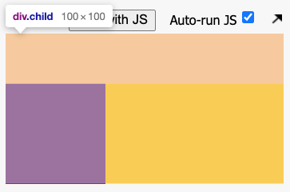

# 마진 겹침 현상 (margin collapsing)

마진 겹침 현상(마진상쇄)이란?

1. 요소와 요소의 사이에 마진 탑(margin-top) 혹은 마진 바텀(margin-bottom)의 공간이 있을 경우 더 높은 값의 마진 값이 적용되는 현상

```html
<!-- 마진 값이 높은 쪽의 마진만 적용 -->
<!DOCTYPE html>
<html lang="ko">
  <head>
    <meta charset="UTF-8" />
    <meta name="viewport" content="width=device-width, initial-scale=1.0" />
    <meta http-equiv="X-UA-Compatible" content="ie=edge" />
    <title>Static Template</title>

    <style>
      div {
        width: 100px;
        height: 100px;
        border: 1px solid black;
      }

      .first {
        margin-bottom: 30px;
        border: 1px solid black;
      }

      .second {
        margin-top: 60px;
        border: 1px solid black;
      }
    </style>
  </head>
  <body>
    <div class="first">1</div>
    <div class="second">2</div>
  </body>
</html>
```

2. 부모 요소와 자식 요소가 존재할 때, 자식 요소의 마진 탑 혹은 마진 바텀 값이 부모의 높이에 영향을 미치지 않는 현상

```html
<!-- 부모의 높이를 따로 지정하지 않으면 자식의 높이만큼 부모의 높이가 지정된다.
하지만 위와 같은 경우 자식의 마진 탑, 바텀 값이 부모의 높이에 영향을 미치지 않게 된다. -->

<!DOCTYPE html>
<html lang="ko">
  <head>
    <meta charset="UTF-8" />
    <meta name="viewport" content="width=device-width, initial-scale=1.0" />
    <meta http-equiv="X-UA-Compatible" content="ie=edge" />
    <title>Static Template</title>

    <style>
      .parent {
        background-color: yellow;
      }
      .child {
        width: 100px;
        height: 100px;
        margin-top: 50px;
        background-color: red;
      }
    </style>
  </head>
  <body>
    <div class="parent">
      <div class="child"></div>
    </div>
  </body>
</html>
```

아래 그림처럼 .child 요소의 마진 값이 부모 영역을 넘어서고 있는 모습을 확인할 수 있다. 이런 현상을 해결하지 않는다면 내 생각과 다른 UI가 구성될 가능성이 있다. 예를 들어 부모와 자식요소 모두에게 마진탑을 주고 싶은 경우 낮은 값의 마진 탑 값이 상쇄되어 버린다.



이와 같은 현상을 해결하는 방법을 이야기해보자.

1. 부모 요소에 overflow 속성 값을 적용해줍니다.
2. 부모 요소에 display: inline-block 값을 적용해줍니다.
3. 부모 요소에 border 값을 적용해줍니다.

이 세 가지 방법 중에 상황에 가장 알맞는 방법을 사용하면 된다.
