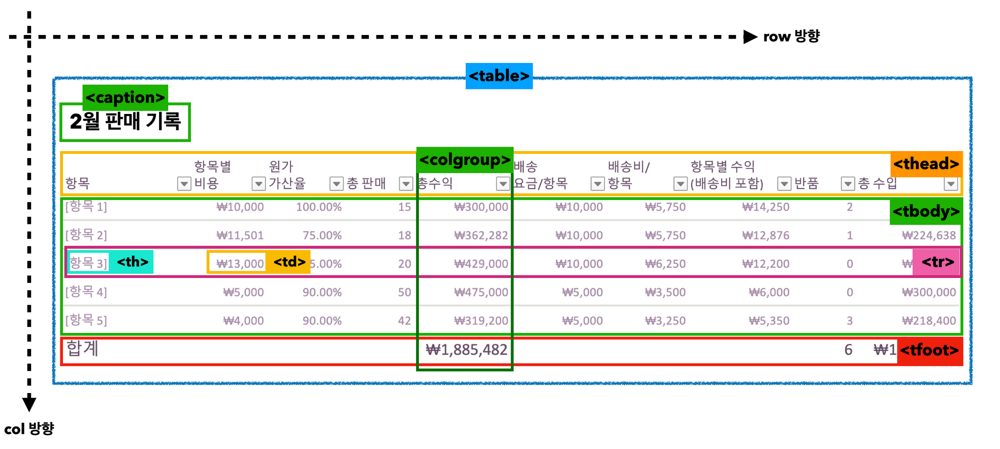

# HTML Table

오늘은 Table에 대해 정리해보려한다. 과거에도 Table을 공부하고 사용도 해봤지만 배울때마다 새로운것같은 이느낌은 내가 제대로 공부를 안한것일까 생각이 든다.. 바로 본론으로 들어가보자!

테이블을 사용할 때 다음 이미지처럼 사용한다.



테이블 예시

```html
<table>
  <!-- caption: 테이블의 제목이나 설명을 의미한다. table 요소의 첫번째 자식으로 사용해야 한다. -->
  <caption>
    테이블의 제목을 표시함. 캡션안에 다른태그들이 들어올 수는 있지만 캡션태그가
    두개가 있으면 html validator에 걸림!
  </caption>

  <!-- thead, tbody, tfoot : 각각 머리글, 본문, 바닥 글을 의미한다. 테이블의 레이아웃에는 영향을 미치지 않지만 CSS를 사용해서 각각의 스타일을 지정할 수 있다. -->
  <thead>
    <tr>
      <!-- 테이블의 상단의 행이 나온다. -->
      <th>HTML</th>
      <!-- table head -->
      <th>CSS</th>
      <th>JAVASCRIPT</th>
      <th>REACT</th>
    </tr>
  </thead>
  <!-- 테이블의 데이터가 나온다. -->
  <!-- 아래에서 보이는것처럼 row기준 한줄은 홀수, 한줄은 짝수가 들어간다. -->
  <tbody>
    <tr>
      <td>1</td>
      <td><!-- table data --></td>
      <td>3</td>
      <td></td>
      <td>5</td>
      <td></td>
      <td>7</td>
      <td></td>
    </tr>
    <tr>
      <td>2</td>
      <td><!-- table data --></td>
      <td>4</td>
      <td></td>
      <td>6</td>
      <td></td>
      <td>8</td>
      <td></td>
    </tr>
  </tbody>
</table>
```

## colspan, rowspan

열간 병합 및 행간 병합할때 사용한다. colspan은 column을 2개 합치는 것으로 실질적으로 row가 병합되는 것처럼 보인다. rowspan은 그 반대이다. th태그 또는 td태그에서 속성을 줘서 사용한다.

## colgroup, col

`<colgroup>`과 그 자식 요소로 쓰이는 `<col>` 요소를 통해 한 열에 공통적인 스타일을 주는것도 가능하다. `<colgroup>` 안의 `<col>` 요소는 각각 테이블의 ‘열’ 을 의미한다.

```html
<!DOCTYPE html>
<html>
  <head>
    <meta charset="UTF-8" />
    <title>Page Title</title>
    <style>
      table {
        width: 100%;
      }
      table,
      tr,
      th,
      td {
        border: 1px solid black;
        border-collapse: collapse;
      }
      .구분 {
        width: 20%;
      }
      .이름 {
        width: 50%;
      }
      .판매량 {
        width: 20%;
      }
    </style>
  </head>
  <body>
    <table>
      <caption>
        이 table은 영국에서 최초로 시작되어 일년에 한바퀴 돌면서...
      </caption>
      <colgroup>
        <col class="구분" />
        <col class="이름" />
        <col class="판매량" />
      </colgroup>
      <thead>
        <tr>
          <th>구분</th>
          <th>이름</th>
          <th>판매량</th>
        </tr>
      </thead>
      <tbody>
        <tr>
          <td>1</td>
          <td>해리포터</td>
          <td>100</td>
        </tr>
        <tr>
          <td>2</td>
          <td>헝거게임</td>
          <td>200</td>
        </tr>
        <tr>
          <td>3</td>
          <td>반지의제왕</td>
          <td>300</td>
        </tr>
      </tbody>
      <tfoot>
        <tr>
          <td colspan="2">총 판매량</td>
          <td>600</td>
        </tr>
      </tfoot>
    </table>
  </body>
</html>
```

## scope

`<th>` 요소에 `scope` 속성을 사용해 `<td>` 와의 연결 관계를 설정 할 수 있다. SEO에서 좀 더 명확하게 데이터가 어떻게 구성되어 있는지 알 수 있다.

- row : 행 방향 진행이다. 내용의 흐름이 왼쪽에서 오른쪽으로 연결되어 있음을 알 수 있디.
- col : 열 방행 진행이다. 내용의 흐름이 위에서 아래로 연결되어 있음을 알 수 있디.

```html
<table>
  <caption>
    요일별 급식 만족도
  </caption>
  <tbody>
    <tr>
      <th></th>
      <th scope="col">월요일</th>
      <th scope="col">화요일</th>
      <th scope="col">수요일</th>
      <th scope="col">목요일</th>
      <th scope="col">금요일</th>
      <th scope="col">토요일</th>
    </tr>
    <tr>
      <th scope="row">메뉴</th>
      <td>돈까스</td>
      <td>짜장면</td>
      <td>볶음밥</td>
      <td>해물라면</td>
      <td>잔치국수</td>
      <td>떡볶이</td>
    </tr>
  </tbody>
  <tfoot>
    <tr>
      <th scope="row">만족도</th>
      <td>3/5</td>
      <td>4/5</td>
      <td>1/5</td>
      <td>5/5</td>
      <td>2/5</td>
      <td>3/5</td>
    </tr>
  </tfoot>
</table>
```
