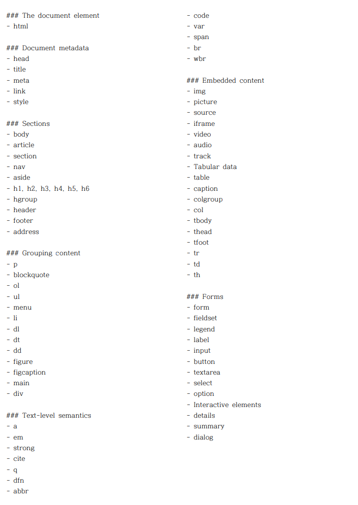

# 조금 더 시멘틱한 HTML을 작성하기

조금 더 시멘틱한 html을 작성하기위해 [많이 사용하는 태그가 나온 정보](https://www.advancedwebranking.com/seo/html-study/) 위주로 나중에 참고해볼 태그를 정리한다.

## [`<abbr> 태그`](https://developer.mozilla.org/ko/docs/Web/HTML/Element/abbr)

줄임말을 사용할 때 abbr 태그를 사용한다. abbr태그의 title 속성을 사용하면 줄임말의 전체 뜻이나 설명을 쓸 수 있다. 그리고 마우스를 올리면 그 뜻이나 설명을 볼 수 있다.

```html
<p>
  You can use
  <abbr title="Cascading Style Sheets">CSS</abbr>
  to style your
  <abbr title="HyperText Markup Language">HTML</abbr>
  .
</p>
```

## [`<address> 태그`](https://developer.mozilla.org/ko/docs/Web/HTML/Element/address)

address태그는 가까운 HTML 요소의 사람, 단체, 조직 등에 대한 연락처 정보를 나타낸다.  
물리적 주소, URL, 이메일 주소, 전화번호, SNS 식별자, 좌표 등 어떠한 정보라도 포함할 수 있고, **반드시 포함해야 하는 정보는 연락처가 가리키는 개인, 조직, 단체의 이름**이다

```html
<p>Contact the author of this page:</p>

<address>
  <a href="mailto:jim@rock.com">jim@rock.com</a><br />
  <a href="tel:+13115552368">(311) 555-2368</a>
</address>
```

```html
<address>
  You can contact author at
  <a href="http://www.somedomain.com/contact"> www.somedomain.com</a>.<br />
  If you see any bugs, please
  <a href="mailto:webmaster@somedomain.com"> contact webmaster</a>.<br />
  You may also want to visit us:<br />
  Mozilla Foundation<br />
  331 E Evelyn Ave<br />
  Mountain View, CA 94041<br />
  USA
</address>
```

## [`<pre> 태그`](https://developer.mozilla.org/ko/docs/Web/HTML/Element/pre)

html안에서 아무리 Enter를 치거나 스페이스를 하여 공백을 표시한다고해서 브라우저에 Enter나 공백이 나오지는 않는다. 그래서 br태그를 이용하거나, 공백은 &nbsp 라는 문구를 삽입해서 공백을 표현한다. 하지만 일일이 여러 태그를 이용해서 개행이나 공백을 넣지 않아도 공백과 개행을 적용할 수 있는 태그가 바로 pre태그이다.

```
<pre>
  L          TE
    A       A
      C    V
       R A
       DOU
       LOU
      REUSE
      QUE TU
      PORTES
    ET QUI T'
    ORNE O CI
     VILISÉ
    OTE-  TU VEUX
     LA    BIEN
    SI      RESPI
            RER       - Apollinaire
</pre>
```

## [`<time> 태그`](https://developer.mozilla.org/ko/docs/Web/HTML/Element/time)

```html
<p>
  The Cure will be celebrating their 40th anniversary on
  <time datetime="2018-07-07">July 7</time> in London's Hyde Park.
</p>

<p>
  The concert starts at
  <time datetime="20:00">20:00</time>
  and you'll be able to enjoy the band for at le123123123astasdsad
  <time datetime="PT2H30M">2h 30m</time>.
</p>

<script>
  let time = document.querySelectorAll("time");
  console.log(time[0].dateTime);
</script>
```

## [`<cite> 태그`](https://developer.mozilla.org/ko/docs/Web/HTML/Element/cite)

저작물의 출처를 표기할 때 사용한다.

```html
<figure>
  <blockquote>
    <p>
      It was a bright cold day in April, and the clocks were striking thirteen.
    </p>
  </blockquote>
  <figcaption>
    First sentence in
    <cite
      ><a href="http://www.george-orwell.org/1984/0.html"
        >Nineteen Eighty-Four</a
      ></cite
    >
    by George Orwell (Part 1, Chapter 1).
  </figcaption>
</figure>
```

## cheatsheet

;
