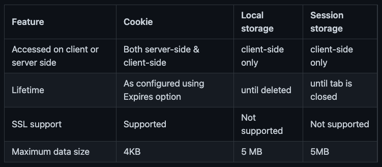

# LocalStorage & SessionStorage 공통점

- 쿠키의 단점을 보완해 HTML 5에서 추가된 저장소이다.
  그래서 HTML5를 지원하지 않는 브라우저에서는 사용이 불가능하다.
- 최대 5MB를 저장할 수 있다. 그래서 많은 정보를 저장할 수도 있다(?) ✍️
- Key와 Value 형태로 이루어짐
- 클라이언트에 대한 정보를 저장

# Localstaorage

- 사용자가 지우지 않는 이상 영구적으로 브라우저에 남아 있는다.

# SessionStorage

- 탭을 종료하면? 윈도우를 닫게되면? 세션스토리지는 사라진다(정확히 알아보기) ✍️

# Cookie

- 최대 4kb의 용량 제한이 있고 매 HTTP요청마다 포함되어 서버로 쿠키가 같이 전송되어서 서버에 부담이 될 수 있다.
- 대부분의 브라우저가 지원한다.
- 쿠키의 구조는 이름(name), 값(value), 속성(이름/값의 쌍)으로 구성된다.
  - 이름과 값은 필수 값이다.
  - 속성은 옵션 값으로 쿠키 만료 기간, 도메인 등의 정보가 올 수 있습니다.

# 사용처

- 자동 로그인 -> 로컬스토리지
- 입력 폼 정보 -> 세션스토리지
- 비로그인 장바구니 -> 세션스토리지
- 다시 보지 않음 팝업 창 -> 쿠키

# 기록

- 쿠키는 HTTP 쿠키, 웹 쿠키 또는 브라우저 쿠키라고 불리웁니다.
- 서버에서 쿠키를 설정해 주기 때문에 쿠키가 브라우저 간에 공유된다고 혼동을 줄 수 있지만 브라우저에서 쿠키를 저장하기 때문에 브라우저 간의 쿠키는 공유 되지 않습니다.
- 쿠키는 상태가 없는(stateless) HTTP 프로토콜에서 상태 정보를 기억하기 위해 사용됩니다. 상태가 없는(무 상태) 프로토콜은 이전 요청과 상관없이 각각의 요청을 독립적인 트랜잭션으로 취급하기 때문에 이전 요청의 상태를 저장하지 않습니다. 쿠키를 사용하면 이전 요청의 상태를 저장할 수 있기 때문에 쿠키는 크게 아래와 같은 3가지 목적으로 사용됩니다.
  - 세션 관리(Session Management): 서버에 저장해야 할 로그인, 장바구니 등의 정보 관리
  - 개인화(Personalization): 사용자 선호, 테마 등의 정보 관리
  - 트레킹(Tracking): 사용자 행동을 기록하고 분석하기 위한 정보 관리
- 서버는 HTTP 요청에 응답 할 때 응답에 `Set-Cookie` 헤더를 전송하면 브라우저에서는 `Set-Cookie`
   헤더를 보고 쿠키를 저장합니다. 그 후 브라우저에서 같은 서버에 요청을 할 때 `Cookie` 헤더에 쿠키를 포함하여 전송합니다.

# 참고

- [https://beomy.github.io/tech/browser/cookie/](https://beomy.github.io/tech/browser/cookie/)
