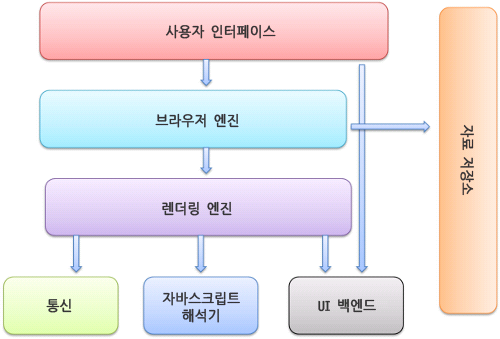

# 홈페이지가 사용자에게 어떻게 보여지게 되는가?

## 과정

1. 브라우저 사용자 인터페이스의 한 종류인 주소창에 입력된 주소를 통해 브라우저엔진에게 전달됩니다.
2. 브라우저엔진은 쿠키나 세션에 캐싱이 되어있는지 확인하고 요청한 정보가 없으면 렌더링 엔진에게 보냅니다.
3. 렌더링엔진은 브라우저엔진이 캐싱되어있는 정보를 보냈다면 통신을 생략하고 바로 자바스크립트 해석기를 통해 해석하고, 그리고 UI 백엔드를 통해 그리게됩니다.
4. 먄약 브라우저엔진에서 자료저장소에 캐싱된정보를 찾을 수 없었다면 url 정보로 request를 보내고, response를 받아서 받은 정보를 자바스크립트해석기로 해석하고 UI 백엔드에 그리게됩니다.

## Critical Rendering Path(CRP)

브라우저가 서버에서 HTML 응답을 받으면, 화면에 표시되기 전에 많은 단계를 거쳐야 하는데 브라우저가 페이지의 초기 출력을 위해 실행해야하는 이 순서를 Critical Rendering Path(CRP)라고 한다.

1. HTML 파싱 후, DOM(Document Object Model) 트리 구축
2. CSS 파싱 후, CSSOM(CSS Object Model) 트리 구축
3. JavaScript 실행
4. DOM과 CSSOM을 조합하여 렌더트리(Render Tree) 구축
5. 뷰포트 기반으로 렌더트리의 각 노드가 가지는 정확한 위치와 크기 계산하여 레이아웃 생성 (Layout / Reflow 단계)
6. 계산한 위치와 크기를 기반으로 화면에 그리기 (페인팅)

### DOM 트리 구축

DOM(Document Object Model) 트리는 완전히 구문 분석된 HTML 페이지의 Object 표현이다.

루트 요소 `<html>` 로 시작하여 페이지의 각 element / text 에 대한 노드가 만들어진다. 다른 요소 내에 중첩된 요소는 자식 노드로 표시되며 각 노드에는 해당 요소의 전체 특성이 포함된다.

HTML의 장점은 부분적으로 실행될 수 있다는 것이다. 페이지에 내용이 표시하기 위해 전체 문서를 로드할 필요가 없다. 그러나 다른 리소스인 CSS와 JS는 페이지 렌더링을 차단할 수 있다.

### CSSOM 트리 구축

CSSOM(CSS Object Model)은 DOM과 연관된 스타일의 Object 표현이다.  
 CSSOM은 DOM과 비슷한 방식으로 표현되지만, 명시적 또는 암시적 선언과 상속 여부에 관계없이 각 노드의 관련 스타일로 표시된다.  
 CSS는 "렌더링 차단 리소스" 로 간주된다.  
 즉, 먼저 리소스를 완전히 파싱 하지 않으면, 렌더트리를 구성 할 수 없다. CSS는 HTML과 달리 계단식 상속 특성 때문에 부분적으로 실행될 수 없다. 문서의 뒷 부분에 정의된 스타일은 이전에 정의된 스타일을 무시하고 변경할 수 있다.  
 따라서 스타일 시트 전체가 파싱 되기 전에 스타일 시트에서 앞에서 정의한 CSS 스타일을 사용하기 시작하면 잘못된 CSS가 적용되는 상황이 발생할 수 있다.  
 즉, 다음 단계로 넘어 가기 전에 CSS를 완전히 파싱 해야 한다.

### JavaScript 실행

JavaScript는 "파서 차단 리소스"로 간주된다.  
 즉, HTML 문서 자체의 구문 분석은 JavaScript에 의해 차단된다. 파서가 `<script>` 태그에 도달하면 (외부 태그 인 경우) fetch를 중단하고 실행한다. 따라서 문서 내의 요소를 참조하는 JavaScript 파일이 있는 경우 해당 문서가 표시된 후에 배치 해야 한다.  
 JavaScript가 파서 차단되는 것을 피하기 위해 `<script async src="script.js">` 와 같이 `async` 속성을 적용하여 비동기적으로 로드 할 수 있다. 또는 `defer` 속성을 이용하여 나중에 자바스크립트를 실행하도록 할 수 있다.

### 렌더트리 구축

렌더트리는 DOM과 CSSOM의 조합이다. 페이지에서 최종적으로 렌더링 될 내용을 나타내는 트리다.  
 즉, 표시되는 내용만 캡쳐하기 때문에 `display:none`을 사용하여 CSS로 숨겨진 요소는 포함하지 않는다.

### 레이아웃 생성하기

레이아웃은 뷰포트의 크기를 결정하며, 뷰포트의 크기는 뷰포트의 크기와 관련있는 CSS 스타일에 대한 컨텍스트를 제공한다. 뷰포트 크기는 `<meta>` 태그의 viewport 속성을 통해 결정되는데, 기본 뷰포트 너비는 980px 이다.

(일반적으로 메타태그의 뷰포트 값은 장치 너비에 맞게 설정한다.)

### 페인팅

그리는 단계에서는 페이지의 가시적인 내용을 픽셀로 변환하여 화면에 표시한다.  
페인팅 단계에서 소요되는 시간은 DOM의 크기와 적용되는 스타일에 따라 다르다. (예를 들면, 복잡한 gradient 배경은 단순 배경색보다 더 많은 시간이 소요된다.)

## 참고

1. [CRP](https://wonism.github.io/critical-rendering-path/)
