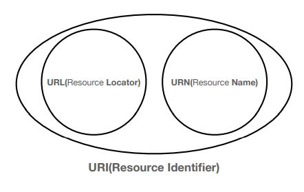
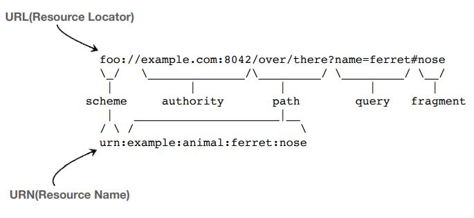
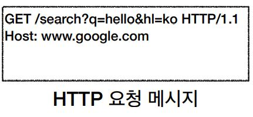
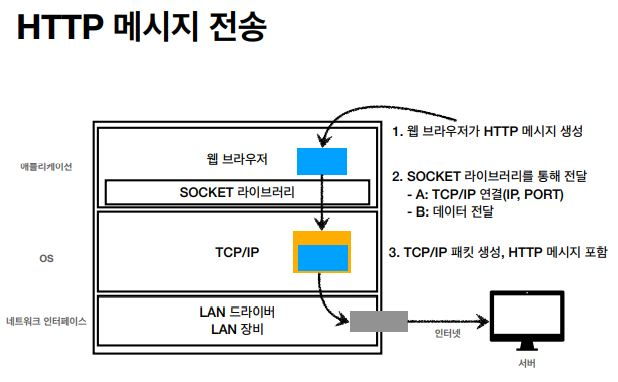
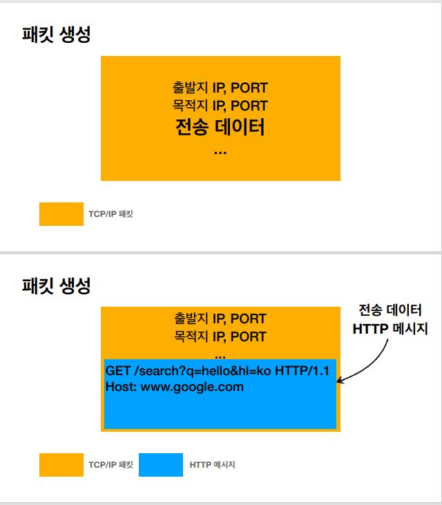
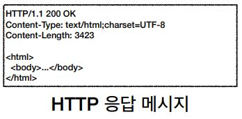

# URI(Uniform Resource Identifier)
 - Resource를 식별하는 통합된 방법이라는 뜻
 - <b>U</b>niform: 리소스 식별하는 통일된 방식  
 <b>R</b>esource: 자원, URI로 식별할 수 있는 모든 것(제한 없음)  
 <b>I</b>dentifier: 다른 항목과 구분하는데 필요한 정보

## URI
 - 로케이터(locator), 이름(name) 또는 둘 다 추가로 분류될 수 있다.

    

## URL(Uniform Resource Locator), URN(Uniform Resource Name)
 - URL : 리소스의 위치를 나타낸다. (리소스가 이 위치에 있어요.)  
 URN : 리소스에 이름을 부여  
 ex) 배기훈이 사는곳에서 사는곳은 URL, 배기훈은 URN
 - 일반적으로 웹 브라우저에서 적는것이 URL이고, URN은 이름을 부여해 버리는것이다.
 - URL과 URN은 아래와 같이 생겼다.
 

    

 - URN 이름만으로 실제 리소스를 찾을 수 있는 방법이 보편화 되지 않음
 - http 기본 포트는 80, https 기본 포트는 443

 
 

# 웹 브라우저 요청 흐름
 https://www.google.com:443/search?q=hello&hl=ko 조회시 과정  

 1. DNS 서버를 조회해서 www.google.com의 IP를 찾아낸다. 
 2. 포트가 존재하지 않으면 HTTP는 80포트 , HTTPS 는 443포트로 인식한다.
 3. 클라이언트 서버에서 HTTP 요청 메시지를 생성한다. HTTP 요청 메시지는 아래와 같이 생겼다.
 

    

 4. 그리고 아래 이미지와 같은 과정으로 진행된다. 

    

5. 패킷을 생성하는 과정은 아래 이미지와 같다. 

    

6. 구글서버에서 이 요청패킷이 도착하면 TCP/IP 패킷을 까서 버리고, 메시지를 꺼내서 해석을 하게 된다. 해석하는 내용은 path와 query를 해석하게된다.

7. 그리고 구글 서버에서 HTTP 응답 메시지를 보낸다. 응답메시지는 아래 이미지와 같다.  

    

8. 웹브라우저는 응답메시지를 열어서 HTML태크를 렌더링 시켜서 보여주게 된다.