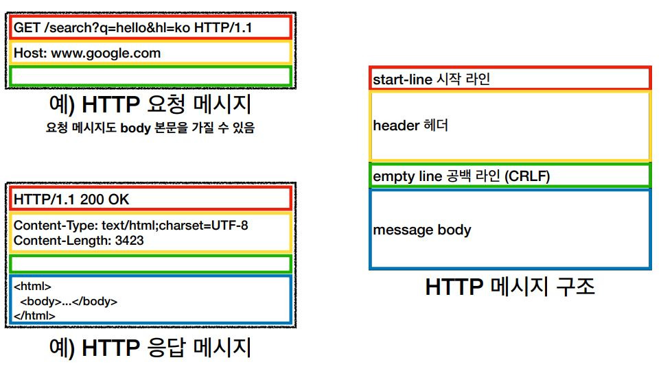

# 모든 것이 HTTP

## HTTP(HyperText Transfer Protocol)
 - 지금은 메시지에 모든 것을 전송한다.
   - HTML, TEXT
   - IMAGE, 음성, 영상, 파일
   - JSON, XML (API)
   - 거의 모든 형태의 데이터 전송 가능
   - 서버간에 데이터를 주고 받을 때도 대부분 HTTP 사용
   - <b>지금은 HTTP 시대!</b>

### HTTP 역사
 - HTTP/0.9 1991년: GET 메서드만 지원, HTTP 헤더X
 - HTTP/1.0 1996년: 메서드, 헤더 추가
 - <b>HTTP/1.1 1997년: 가장 많이 사용, 우리에게 가장 중요한 버전</b>
   - RFC2068 (1997) -> RFC2616 (1999) -> RFC7230~7235 (2014)
 - HTTP/2 2015년: 성능 개선
 - HTTP/3 진행중: TCP 대신에 UDP 사용, 성능 개선

### 기반 프로토콜
 - TCP: HTTP/1.1, HTTP/2
 - UDP: HTTP/3
 - 현재 HTTP/1.1 주로 사용
   - HTTP/2, HTTP/3 도 점점 증가
 > 크롬 브라우저 > 개발자도구 > network Tab > protocol을 보면 확인이 가능!

### HTTP 특징
 - 클라이언트 서버 구조
   - HTTP는 클라이언트가 HTTP메시지를 통해서 서버에 요청을 보내고, 클라이언트는 서버에서 응답이 올때 까지 기다린다. 서버가 요청에 대한 결과를 만들어서 응답이 오면 응답 결과를 열여서 클라이언트가 동작하게 된다. 
   - 이렇게 클라이언트와 서버를 분리를 하는것이 중요하다.  
   비지니스로직과 데이터들은 서버에 다 밀어넣고, 클라이언트는 UI에 집중한다.  
    이렇게 되면 서버와 클라이언트는 각각 독립적으로 진화를 할 수 있다.  
     예를 들어서 복잡한 비지니스로직과 데이터를 다룰 필요없고, 단순하게 UI와 UX를 어떻게 그릴지와 같은 생각에 집중하면 되고, 반대로 서버도 트래픽이 100배 폭주한다면 클라이언트를 손댈 필요없이 서버의 아키텍처를 어떤식으로 할지, 백앤드기술을 어떻게 고도화할지, 그것만 고민하면된다.  
      예를 들어 php를 쓰다가 자바로 바꾸게 되어도 클라이언트는 그것에 대해서 몰라도 된다.  
       이러게 클라이언트 서버 구조로 만들게 되면 양쪽이 독립적으로 진화를 할 수 있게 된다. 
 - 무상태 프로토콜(스테이스리스), 비연결성
   - 서버가 클라이언트의 상태를 보존하지않는다.
   - 장점: 서버 확장성 높음(스케일 아웃)
   - 단점: 클라이언트가 추가 데이터 전송(데이터를 너무 많이 보내야 한다.)
   - Stateful, Stateless 차이  
     - 상태 유지: 중간에 다른 점원으로 바뀌면 안된다.  
     (중간에 다른 점원으로 바뀔 때 상태 정보를 다른 점원에게 미리 알려줘야 한다.)
     - 무상태: 중간에 다른 점원으로 바뀌어도 된다.
     - 갑자기 고객이 증가해도 점원을 대거 투입할 수 있다.
     - 갑자기 클라이언트 요청이 증가해도 서버를 대거 투입할 수 있다.
     - 무상태는 응답 서버를 쉽게 바꿀 수 있다. -> 무한한 서버 증설 가능
   - Stateless 실무 한계
        - 모든 것을 무상태로 설계 할 수 있는 경우도 있고 없는 경우도 있다.
        - 무상태 예시: 로그인이 필요 없는 단순한 서비스 소개 화면
        - 상태 유지 예시: 로그인
        - 로그인한 사용자의 경우 로그인 했다는 상태를 서버에 유지
        - 일반적으로 브라우저 쿠키와 서버 세션등을 사용해서 상태 유지
        - 상태 유지는 최소한만 사용
 - HTTP 메시지
   - HTTP 메시지 구조는 아래 그림과 같다.  
      
   

        
   

   
   - 단순함, 확장 가능
