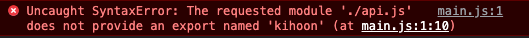

# 바닐라자바스크립트 import 와 export에 대해

나는 모듈을 여러개 만들어 하나의 자바스크립트 파일에 넣고 html에서 하나의 스크립트 태그만 넣어서 작업하고 싶었다. 그래서 import와 export 하는 방법을 찾아보았는데 너무 헷갈렸다. 아래 참고자료인 유튜브를 보며 잘 이해할 수 있었다. 그래서 정리해 놓으려 한다.

## 과정

우선 html 파일에서 script 태그를 넣겠지?

```html
<!-- index.html -->
<!DOCTYPE html>
<html lang="ko">
  <head>
    <meta charset="UTF-8" />
    <meta http-equiv="X-UA-Compatible" content="IE=edge" />
    <meta name="viewport" content="width=device-width, initial-scale=1.0" />
    <title>바닐라자바스크립트 import 와 export에 대해</title>
  </head>

  <body>
    <main>바닐라자바스크립트 import 와 export에 대해</main>
  </body>
  <script src="./js/main.js"></script>
</html>
```

그러면 main.js 파일과 api.js파일을 만들었다고 가정하고 api.js 에서 모듈을 하나 만든다.

```javascript
// api.js
const kihoon = {
  name: "기훈",
  age: 30,
  address: "마포구",
};
```

그리고 import를 이용해서 main.js에서 가져와보려 한다.

```javascript
// main.js
import { kihoon } from "./api.js";

console.log(kihoon);
console.log(kihoon.name);
```

하지만 이렇게 하면 콘솔창에 다음과 같은 에러메시지만 보이게 된다.  


원인은 2가지가 있다.  
우선 index.html 파일로 돌아가서 script 태그를 넣을 때 type="module"을 추가해 줘야 한다.

```html
<!-- index.html -->
...
<script src="./js/main.js" type="module"></script>
...
```

하나의 원인은 해결되었다. 그런다음 콘솔창을 보면 또 다른 에러메시지를 확인할 수 있다.



이 원인의 해결방법은 api.js 파일에서 모듈을 export 해줘야 다른곳에서 import해서 사용이 가능하다.

```
const kihoon = {
  name: "기훈",
  age: 30,
  address: "마포구",
};

export { kihoon };
```

이렇게 하면 콘솔창에서 정상적으로 출력되는 것을 볼 수 있다.

## 회고

나는 javascript를 열심히 공부했다고 생각했는데 이런 작은 개념도 알지못했고, 누군가에게 설명하기 힘들었다. 미니프로젝트를 시작하면서 이런 부분까지 신경쓸수 있는 기회가 주어져 정말 다행이라고 생각한다. 하나하나 차근차근 정리하며 열심히 공부해보자!

### 참고자료

[import를 JS에서? 모듈 파헤치기](https://www.youtube.com/watch?v=ADTAkHkqFmM&ab_channel=%EB%93%9C%EB%A6%BC%EC%BD%94%EB%94%A9by%EC%97%98%EB%A6%AC)
