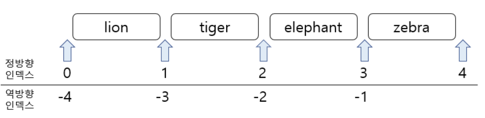

# Array​.prototype​.slice()

slice() 메소드는 begin부터 end 전까지의 복사본을 새로운 배열 객체로 반환한다. 즉, 원본 배열은 수정되지 않는다.

slice(start[, end])

<center></center>

- start: 추출 시작점에 대한 인덱스.
  - undefined인 경우: 0부터 slice
  - 음수를 지정한 경우: 배열의 끝에서부터의 길이를 나타낸다. slice(-2)를 하면 배열의 마지막 2개의 요소를 추출한다.
  - 배열의 길이와 같거나 큰 수를 지정한 경우: 빈 배열을 반환한다.
  - 음수를 지정한 경우: 배열의 끝에서부터의 길이를 나타낸다. slice(2, -1)를 하면 세번째부터 끝에서 두번째 요소까지 추출
  - 반환값: 추출한 요소를 포함한 새로운 배열.

```javascript
const animals = ["lion", "tiger", "elephant", "zebra"];
console.log(animals.slice(1, 3)); // ["tiger", "elephant"]
console.log(animals.slice(-3, -1)); // ["tiger", "elephant"]

// 시작위치와 종료위치에 같은 인덱스를 넣으면 빈 배열이 반환된다.
console.log(animals.slice(1, 1)); // []

// end 인덱스는 생략했기 때문에 begin 인덱스부터 가장 마지막 원소까지 출력
console.log(animals.slice(1)); // ["tiger", "elephant", "zebra"]

// 비교되는 함수로 array.shift()가 있으며 첫번째 원소 빼내 반환합니다.(shift는 원본배열에 영향을 준다.)

// start 인덱스는 0으로 가장 앞부터 시작하고 end 인덱스는 끝 한단계 앞인 -1를 지정, 그 결과 마지막 원소를 제외한 결과를 출력
console.log(animals.slice(0, -1)); // ["lion", "tiger", "elephant"]

// 비교되는 함수로 array.pop()가 있으며 가장 뒷 원소 빼내 반환하니다.(pop는 원본배열에 영향을 준다.)

// ----------------------------------------

var arr = [1, 2, 3, 4, 5, 6, 7, 8, 9, 10];
var arr1 = arr.slice(3, 5); // [4, 5]
var arr2 = arr.slice(undefined, 5); // [1, 2, 3, 4, 5]
var arr3 = arr.slice(-3); // [8, 9, 10]
var arr4 = arr.slice(-3, 9); // [8, 9]
var arr5 = arr.slice(10); // []
var arr6 = arr.slice(4); // [5, 6, 7, 8, 9, 10]
var arr7 = arr.slice(undefined); // [1, 2, 3, 4, 5, 6, 7, 8, 9, 10]
var arr8 = arr.slice(5, -4); // [6]
var arr9 = arr.slice(2, 15); // [3, 4, 5, 6, 7, 8, 9, 10]
```

### Ref

1. [slice1](https://im-developer.tistory.com/103)
2. [slice2](https://m.blog.naver.com/wideeyed/221876916945)
